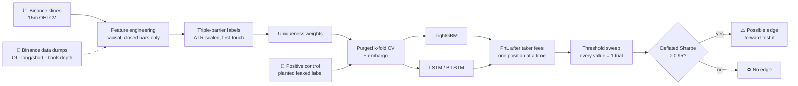

<div align="center">


# Crypto Trading Strategy Backtesting & ML Validation: Triple-Barrier Labels, Purged CV and Deflated Sharpe

**Most crypto trading bots look profitable in a backtest because the backtest quietly leaks the future. EdgeProof is built to catch that. Point it at a strategy or a machine-learning model and it tells you, after fees, whether the edge is real.**

<p>
  
  
  
  
  
  
  
  
</p>

[Why](#-why-this-exists) · [Features](#-features) · [Pipeline](#-how-the-pipeline-works) · [Results](#-results-on-btc-eth--sol) · [Quick start](#-quick-start) · [Structure](#%EF%B8%8F-project-structure)

</div>

---

**EdgeProof** is a **quantitative research framework for crypto perpetual futures** that tests whether a trading signal survives honest evaluation. It combines a **walk-forward backtester**, a **LightGBM** classifier and **LSTM / BiLSTM** sequence models with the anti-overfitting methods from Marcos López de Prado's *Advances in Financial Machine Learning*: **triple-barrier labeling**, **purged k-fold cross-validation with embargo**, **sample-uniqueness weights** and the **Deflated Sharpe Ratio**. Every model is scored on **PnL after taker fees**, never on accuracy.

It also includes a **live market desk** for **MEXC perpetuals**: a multi-timeframe gate scanner, cost-aware risk math, and a gate ablation study that measures whether each trading rule actually earns its place.

## 🎯 Why this exists

A 15-minute crypto model that looks brilliant in a backtest and loses money live is the norm, not the exception. The usual causes are silent:

- **Overlapping labels** leak test data into training under a normal CV splitter.
- **Checking the high before the low** inside one candle books wins that never happened.
- **Sweeping 9 thresholds and reporting the best one** is 9 trials presented as 1.
- **Scoring accuracy instead of PnL** hides that the wins don't cover fees.

EdgeProof closes each of those holes. Then it proves it can still find an edge, by planting one on purpose (see the positive control below). A "no edge" verdict from a harness that can't detect a real edge means nothing. This one can.

## ✨ Features

| | Feature | Details |
|---|---|---|
| 🏷️ | **Triple-barrier labeling** | ATR-scaled take-profit / stop-loss / time barriers, first touch wins. Bars that hit both barriers are dropped, or counted as losses with `--ambiguous conservative` |
| 🧹 | **Purged k-fold + embargo** | Removes training samples whose labels overlap the test fold, then embargoes a buffer after it |
| ⚖️ | **Uniqueness weights** | Inverse label-concurrency weighting. Measured mean uniqueness ~0.175, so naive CV overcounts independent samples ~5.7x |
| 📉 | **Deflated Sharpe Ratio** | Corrects for multiple testing. Every threshold in the sweep counts as a trial |
| 🧪 | **Positive control** | `ml_sanity_check.py` injects a noisy leaked label and reruns the identical pipeline. It must light up, or no null result is trusted |
| 🧠 | **Three model families** | LightGBM, LSTM and BiLSTM (window-to-one output, so the backward pass never sees the future) |
| 🔬 | **Microstructure features** | Open interest, top-trader long/short ratios, taker volume ratio and order-book depth from Binance's free historical dumps |
| 📊 | **Quantile range forecasts** | Predicts how far price can travel, scored by pinball loss and coverage against unconditional and rolling-volatility baselines |
| 🚦 | **Live gate scanner** | 4h direction → 1h structure → 15m volume regime on native MEXC futures data, closed bars only |
| 💸 | **Real execution costs** | Per-symbol taker fees from the MEXC contract API (some pairs are zero-fee), spread and adverse slippage |
| 🧮 | **Gate ablation study** | Removes one rule at a time on held-out data to measure what each rule contributes |
| ✅ | **Leakage tests** | 39 unit tests: no-lookahead features, no fill on the signal bar, stop gaps, ambiguous bars, stale data |

## 🔍 How the pipeline works



## 📊 Results on BTC, ETH & SOL

Shipped in [`reports/`](reports/) so you can check every number.

| Experiment | What was tested | Best profit factor | Deflated Sharpe | Verdict |
|---|---|---|---|---|
| **LightGBM**, klines features | BTC · ETH · SOL, 5,000 × 15m candles each | 0.65 – 0.98 | 0.022 – 0.278 | ⛔ No edge |
| **LightGBM** + microstructure | same, plus OI / long-short / book depth | 0.76 – 0.86 | 0.005 – 0.085 | ⛔ No edge |
| **LSTM / BiLSTM** | 12 symbol × model runs | 0.54 – 0.79 | 0.000 – 0.002 | ⛔ No edge |
| **Positive control** | same harness, planted leaked label | **4.74 – 5.89** | **1.000** | ✅ Detected |
| **Gate ablation** | 6 symbols, ~3 weeks, held-out half | every variant below 0R | – | ⛔ Rules added no measured value |

**What that means:** the harness finds an edge when one exists, and on 15m candle data no directional edge survived fees. That result is the product: it is the check that stops you trading a backtest artifact with real money. In the gate ablation, adding rules made results *worse* (-0.308R per trade with all gates on vs -0.174R with none), the kind of finding an ordinary backtest never shows.

**Volatility is a different story.** The quantile range forecaster beat the unconditional baseline in 41 of 42 target/quantile rows (up to +9.6% pinball skill) and a rolling-volatility model in 29 of 42 (up to +4.1%). How *far* price moves is modestly predictable even when *which way* it moves is not.

## ⚡ Quick start

```bash
git clone https://github.com/intikhab49/edgeproof-crypto-trading-backtest.git
cd edgeproof-crypto-trading-backtest

python -m venv venv
source venv/bin/activate          # Windows: venv\Scripts\activate
pip install -r requirements.txt
```

No API keys needed. Every data source is a public endpoint, cached locally on first run.

```bash
# Run the leakage test suite
cd desk && python -m unittest test_gate_scan test_market_engine test_trade_math && cd ..

# LightGBM harness: triple-barrier + purged CV + deflated Sharpe
cd research
python ml_pipeline.py --symbols BTCUSDT ETHUSDT SOLUSDT --candles 5000
python ml_pipeline.py --micro                 # add open interest + book depth features

# Positive control: prove the harness can detect an edge
python ml_sanity_check.py BTCUSDT

# Sequence models (needs torch)
python ml_seq.py --seq-len 24 --epochs 25
cd ..

# Live MEXC futures gate scan + research desk
python desk/gate_scan.py --symbols SOL_USDT BTC_USDT --verbose
python desk/crypto_desk.py SOL_USDT
python desk/ablation.py --slippage-bps 2
```

> [!TIP]
> Test your own strategy by swapping in your features or rules. Keep the labels, CV and scoring the same, and read the deflated Sharpe instead of the best-looking threshold.

## 🗂️ Project structure

```
research/
├── backtest.py          # walk-forward rule backtester, next-open execution, persistent candle cache
├── ml_pipeline.py       # LightGBM + triple-barrier + purged CV + uniqueness weights + DSR
├── ml_seq.py            # LSTM / BiLSTM under the identical harness
├── ml_sanity_check.py   # positive control (planted leak)
├── ml_forecast.py       # quantile range / adverse-excursion forecasts
├── fetch_micro.py       # Binance OI, long/short and book-depth history → 5m buckets
└── review_signals.py    # trade journal scorecard: R-multiples, fill rate, profit factor
desk/
├── gate_scan.py         # 4h → 1h → 15m gate cascade on MEXC perpetuals
├── crypto_desk.py       # MEXC OHLC, quotes, contract specs, funding, depth + forecast replay
├── market_engine.py     # causal features and setup replay (standard library only)
├── trade_math.py        # cost-aware risk / reward arithmetic
├── ablation.py          # remove-one-gate ablation with bootstrap CIs
└── test_*.py            # 39 leakage and correctness tests
docs/                    # data contract, evaluation protocol, reading guide, journal schema
reports/                 # raw outputs behind every number above
```

## 🧰 Tech stack

**Machine learning:** LightGBM · PyTorch (LSTM, BiLSTM) · scikit-learn · NumPy
**Quant methods:** triple-barrier labeling · purged k-fold CV · embargo · sample uniqueness · Deflated Sharpe Ratio · bootstrap confidence intervals · walk-forward validation
**Market data:** Binance spot klines · Binance USDⓈ-M futures data dumps · MEXC contract API (perpetual futures)

## ⚠️ Disclaimer

Research and educational software. **Not financial advice.** Nothing here places orders. The results above come from specific symbols, timeframes and dates; they show what this data did, not what every market will do. A strategy that passes this harness still needs a forward test before real money.

---

<div align="center">

**Built by [Intikhab Azam](https://github.com/intikhab49)** · AI engineer · machine learning · quantitative research · automation

<sub>Keywords: crypto trading bot backtesting · algorithmic trading · machine learning trading strategy · triple barrier method · purged cross validation · deflated Sharpe ratio · Advances in Financial Machine Learning · López de Prado · overfitting · look-ahead bias · LightGBM · LSTM · BiLSTM · Bitcoin · Ethereum · Solana · perpetual futures · MEXC · Binance · quantitative finance · Python</sub>

</div>
